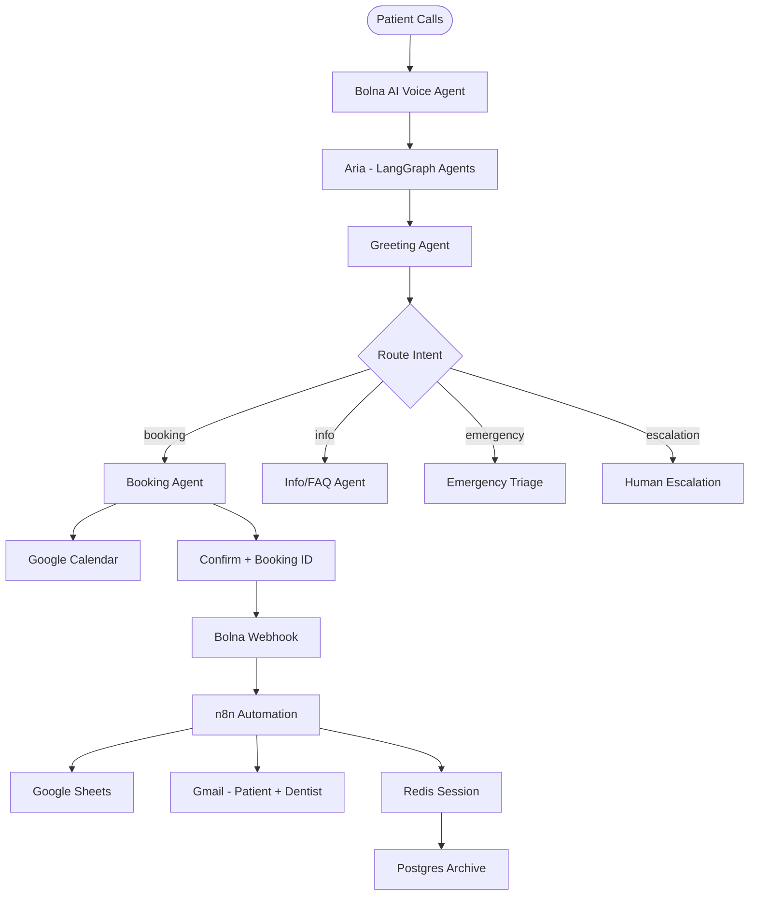

# 🚀 AI Automation Engineer — Build Log

A hands-on journey building production-grade AI automation skills. This repository tracks my progression through LangChain, RAG, LangGraph, and web APIs — applied directly to building **Priya**, a stateful AI assistant for a dental clinic.

---

## 📅 Progress Tracking

### Core Concepts & Fundamentals
- **Day 4** — **LangChain Fundamentals**: Structured output classification using prompt templates, Pydantic parsers, and LCEL chains.
- **Day 5** — **RAG Pipeline**: Implemented document chunking, embeddings, ChromaDB retrieval, and grounded Q&A.
- **Day 6** — **Conversational Agent**: Integrated memory with a combined classify-then-retrieve flow for seamless dialogue.
- **Day 7** — **Tool Calling Agent**: Developed an autonomous agent loop with LangChain's `@tool` decorator, enabling the LLM to execute external functions like checking availability and booking appointments.

### Productionizing & Orchestrating
- **Day 8** — **Unified Agent**: Unified intent classification, tool calling, conversational memory, and in-memory RAG loading into a single chatbot pipeline.
- **Day 9** — **LangGraph Migration**: Refactored the unified agent into a stateful, predictable LangGraph state machine.
- **Day 10** — **FastAPI Integration**: Wrapped the LangGraph agent in a FastAPI web service, exposing `/chat` and `/health` endpoints for external API integrations.
- **Day 11** — **Bolna AI Voice Integration**: Connected Aria to Bolna AI as a Custom LLM via ngrok tunnel. Aria now responds to real voice calls using the `/v1/chat/completions` endpoint.
- **Day 12** — **Phone Numbers & Real Calls**: Purchased Indian DID (+91), configured SIP trunks in Bolna, made first real patient call end-to-end.
- **Day 13** — **Webhook Automation (n8n)**: Built full post-call automation pipeline. Bolna fires a webhook → n8n parses Telugu/multilingual payload → logs to Google Sheets → sends branded Gmail to dentist + patient.
- **Day 14** — **Memory Architecture**: Implemented dual-layer persistence — Redis (Upstash) for real-time call session state + SQLite/Postgres for durable archival. Unified call handler bridges Bolna → Redis → Postgres lifecycle.
- **Day 15** — **Integrations & Multi-Agent**: Google Calendar for availability checks + auto-booking. LangGraph multi-agent orchestrator routing calls through Greeting → Booking/Info/Emergency → Escalation agents in Telugu/Hindi/English.

---

## 🏗️ Architecture



---

## 🛠️ Tech Stack
- **Voice AI**: Bolna AI (multilingual — Telugu, Hindi, English, Tamil)
- **Orchestration**: LangGraph state machine (multi-agent routing)
- **Framework**: LangChain, FastAPI, Uvicorn
- **LLM**: Groq (llama-3.3-70b-versatile)
- **Vector Store**: ChromaDB (In-Memory RAG)
- **Embeddings**: HuggingFace (`sentence-transformers/all-MiniLM-L6-v2`)
- **Automation**: n8n Cloud (webhook → Sheets → Gmail pipeline)
- **Session Memory**: Upstash Redis (real-time call state)
- **Persistent Storage**: SQLite / Supabase Postgres (call archive)
- **Calendar**: Google Calendar API
- **Notifications**: Gmail API (HTML email templates)
- **Language**: Python

---

## 🚀 How to Run the Project

### 1. Install dependencies
```bash
pip install fastapi uvicorn langchain langchain-groq langchain-huggingface langchain-chroma langgraph python-dotenv langchain-community langchain-text-splitters
```

### 2. Configure Environment Variables
Create a `.env` file in the root directory:
```env
GROQ_API_KEY=your_groq_api_key_here
```

### 3. Run the FastAPI Server (Day 10)
```bash
python -m uvicorn day10_fastapi.day10_api:app --reload --port 8000
```

### 4. Query the API
Send a POST request to the `/chat` endpoint:
```powershell
Invoke-WebRequest -Uri "http://127.0.0.1:8000/chat" -Method POST -ContentType "application/json" -Body '{"message": "How much does a root canal cost?", "session_id": "test_001"}' -UseBasicParsing
```